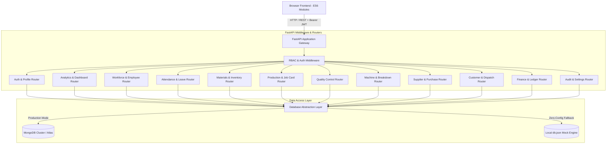
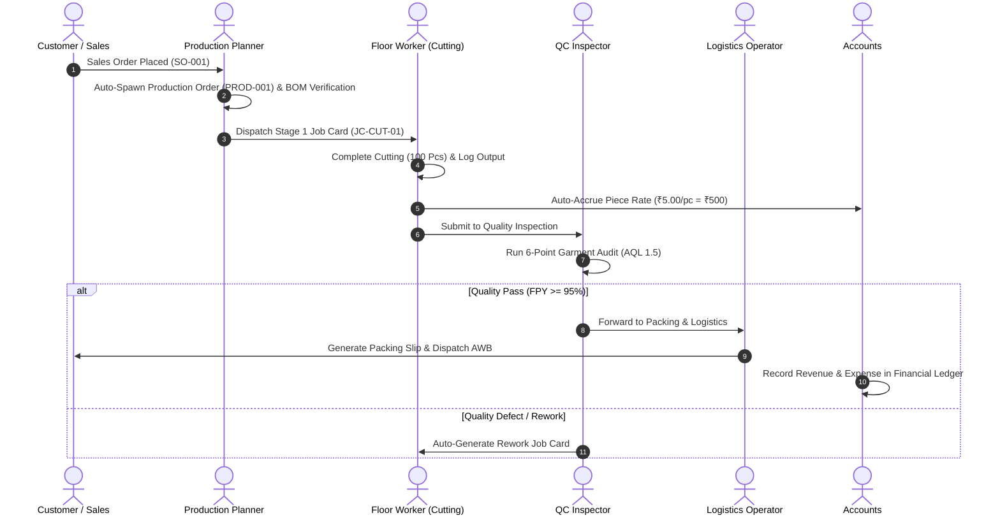

# 🏗️ GarmentFlow ERP — System Architecture & Data Flow

## 1. Executive Summary

**GarmentFlow** is a comprehensive, production-grade Garment Manufacturing Enterprise Resource Planning (ERP) platform built with a modern, high-performance architecture:
- **Backend:** FastAPI (Python 3.10+ async REST API)
- **Database Engine:** Dual-Engine Architecture (Async MongoDB with Motor + High-Fidelity Local JSON Mock DB Engine with MongoDB query operator support: `$in`, `$gte`, `$lte`, `$regex`, `$or`, etc.)
- **Security & RBAC:** JWT Bearer Token Authentication, BCrypt Password Hashing, 4-Tier Role Authorization (`ADMIN`, `MANAGER`, `SUPERVISOR`, `WORKER`)
- **Frontend:** Vanilla ES6 JavaScript Modules with TailwindCSS & Plus Jakarta Sans typography.

---

## 2. High-Level Architecture Diagram



---

## 3. End-to-End Manufacturing Workflow Pipeline



---

## 4. Database Schema Relationships

| Entity | Primary Key | Key Foreign References | Description |
| :--- | :--- | :--- | :--- |
| `users` | `_id` | `department` | System operators, workers, supervisors, managers, admins |
| `departments` | `_id` | - | Factory operational bay / workstation categories |
| `materials` | `_id` | `supplierId` | Raw materials, fabrics, trims, unit costs, and reorder thresholds |
| `boms` | `_id` | `materialId` | Bill of Materials linking finished apparel to raw material consumption |
| `production_orders`| `_id` | `customerId` | Master manufacturing orders with multi-stage progress tracking |
| `job_cards` | `_id` | `productionOrderId`, `workerId`, `machineId` | Atomic work assignments executed at each factory department |
| `qc_inspections` | `_id` | `productionOrderId`, `jobCardId`, `inspectorId` | Quality inspection audits with defect classification and FPY metrics |
| `machines` | `_id` | `operatorId`, `department` | Factory machinery directory, health status, and maintenance tickets |
| `suppliers` | `_id` | - | Raw material vendor directory with ratings and payment terms |
| `purchase_orders` | `_id` | `supplierId`, `materialId` | Vendor procurement orders and Goods Receipt Note (GRN) workflow |
| `customers` | `_id` | - | Wholesale / retail client directory |
| `sales_orders` | `_id` | `customerId` | Commercial sales contracts automatically driving production |
| `dispatches` | `_id` | `salesOrderId`, `productionOrderId` | Packaging slips, courier AWB tracking numbers, and delivery statuses |
| `attendance` | `_id` | `employeeId` | Daily shift clock-in/out records, overtime, and late flags |
| `leaves` | `_id` | `employeeId` | Employee leave requests with approval lifecycle |
| `transactions` | `_id` | `orderId`, `vendorId` | Master double-entry financial ledger recording revenues & expenses |
| `piece_rate_ledger`| `_id` | `workerId`, `jobCardId` | Accrued piece-rate earnings payable to factory operators |
| `audit_logs` | `_id` | `userId` | Immutable system event trail logging user actions and timestamps |

---

## 5. Security & RBAC Enforcement

The system enforces strict 4-tier Role-Based Access Control (RBAC):

```text
[ ADMIN ]
   ├── Full system configuration, factory shift parameters, and audit trails
   ├── Complete financial ledger oversight & piece-rate settlements
   └── User, employee, and role privilege management
         │
[ MANAGER ]
   ├── Sales order bookings, production scheduling, and purchase order approvals
   ├── Material inventory management & BOM configuration
   └── Executive analytics and CSV report generation
         │
[ SUPERVISOR ]
   ├── Daily shift attendance verification & bulk approval
   ├── Job card dispatching, worker/machine assignment, and QC inspections
   └── Machine breakdown ticketing & maintenance resolution
         │
[ WORKER ]
   ├── Mobile workstation task queue view
   ├── Daily shift clock-in / clock-out
   ├── Job progress reporting & defect flagging
   └── Piece-rate earnings ledger view & leave application
```
